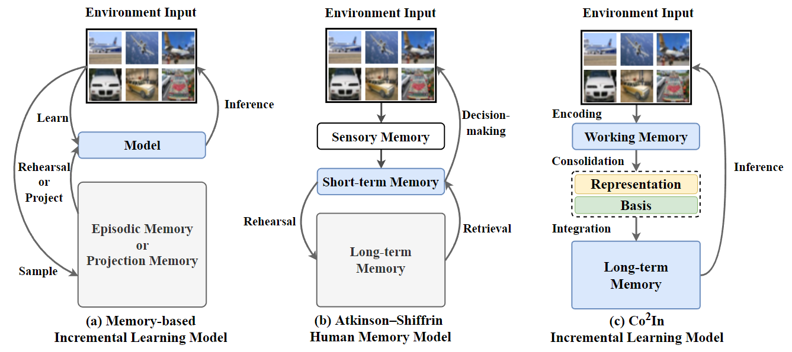
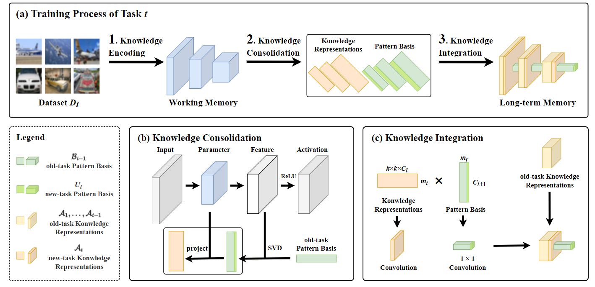
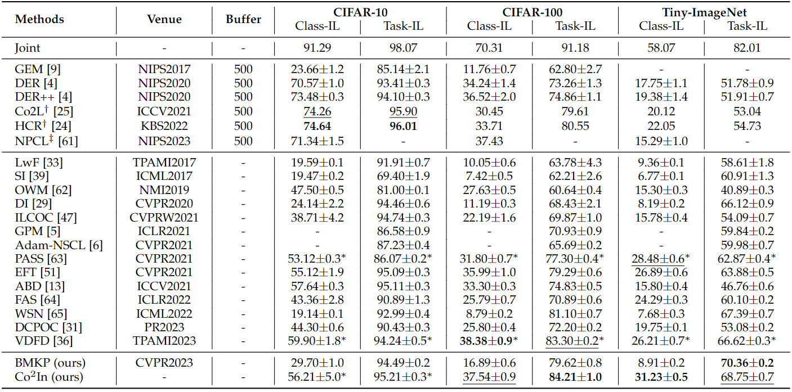

# Co$^2$In 

>   Official repository paper: "Co$^2$In: a Bi-level Memory Incremental Learning Framework with Knowledge Encoding, Consolidation, and Integration"

## Abstract

Incremental learning (IL) requires models to continually acquire new knowledge (**plasticity**) while retaining previously learned information (**stability**). However, striking a balance between plasticity and stability poses a significant challenge for current IL methods. The human brain demonstrates exceptional balance, owing to various memory units collaboratively engaging in the encoding and storage of information. Drawing inspiration from the human memory mechanism, this paper introduces an IL framework with knowledge en**Co**ding, **Co**nsolidation, and **In**tegration (Co$^2$In). The distinct feature of Co$^2$In lies in its bi-level memory architecture: a working memory for adaptively acquiring knowledge and a long-term memory dedicated to persistent retention of information. The two memory modules work cooperatively during IL. The working memory first fits with new data to encode knowledge into parameters. Subsequently, Co$^2$In engages in a consolidation process to identify underlying patterns within the trained parameters, followed by re-expressing the parameters into a compact knowledge representation. Next, the knowledge representation and the identified patterns are converted into separate network layers and integrated into the long-term memory. These designs empower Co$^2$In to consistently accumulate knowledge, maintaining high plasticity and stability. We evaluate Co$^2$In on CIFAR-10, CIFAR-100, and Tiny-ImageNet under exemplar-free Class-IL and Task-IL settings. Experimental results demonstrate that Co$^2$In achieves state-of-the-art performance with efficient memory consumption. 

## Setup

-   Use `./main.py` to run experiments.
-   Some training result can be found in folder `./result`.

## Datasets

**Task-IL settings**

-   Sequential CIFAR-10
-   Sequential CIFAR-100
-   Sequential Tiny ImageNet

## Performance

## Requirement

+ numpy==1.16.4
+ Pillow==6.1.0
+ torch==1.3.1
+ torchvision==0.4.2

## Related repository

https://github.com/SunWenJu123/BMKP

https://github.com/aimagelab/mammoth